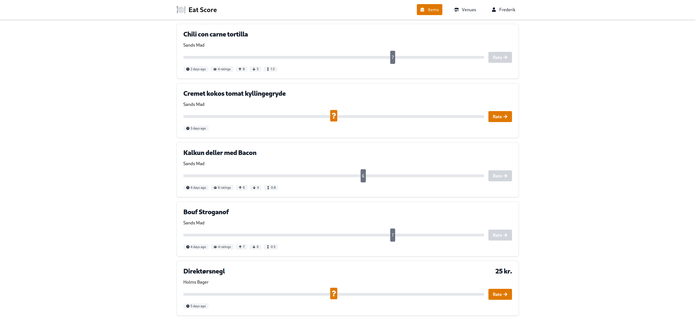

# Eat Score

is a website for rating items at venues. Currently invite only.

[eat-score.hrgn.dk](https://eat-score.hrgn.dk)

### Features
- Dark mode support
- Magic login via email
- Create venues
- Create items at venues
- Rate items from 0 to 10
- Ratings are hidden until you rate
- See average rating of items and venues
- See other users ratings

